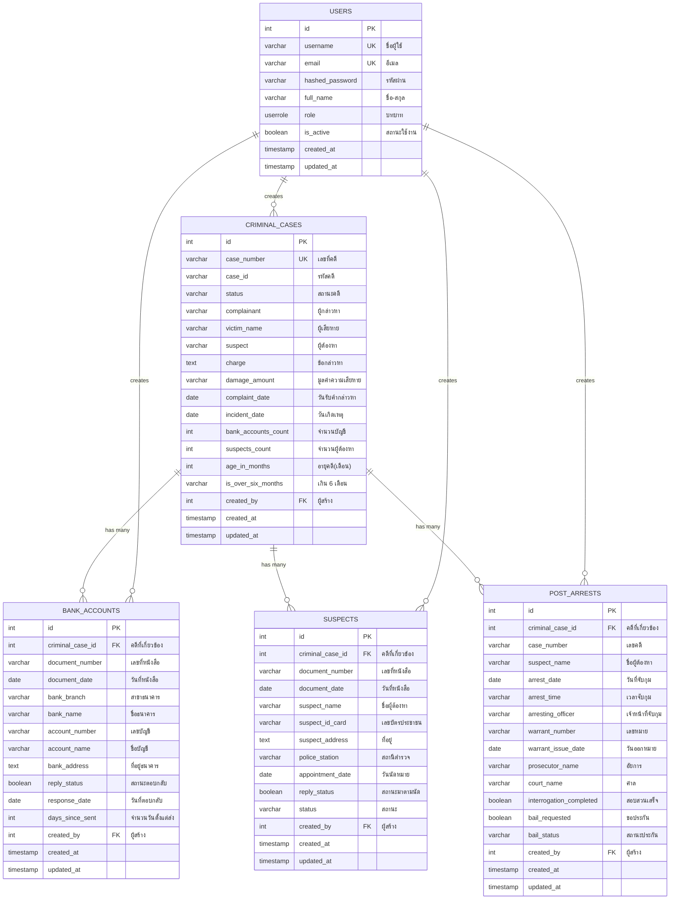
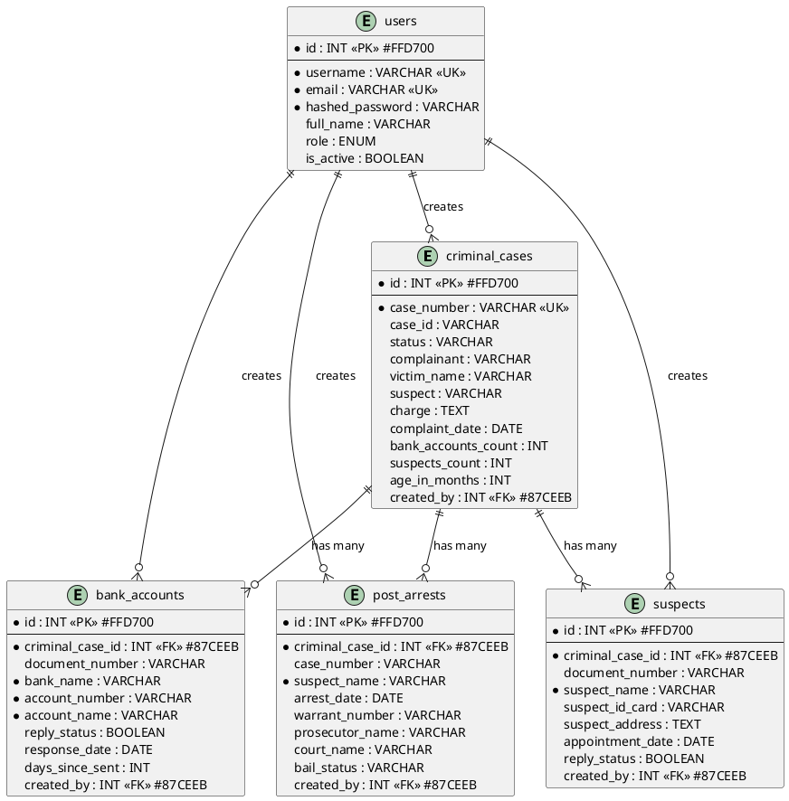

# Database ERD - Criminal Case Management System

## Entity Relationship Diagram

### Visual Representation (Mermaid)



---

## Detailed Cardinality

### 1:N Relationships

```
criminal_cases (1) ──────> (N) bank_accounts
  └─ ON DELETE CASCADE
     ลบคดี → ลบบัญชีธนาคารทั้งหมด

criminal_cases (1) ──────> (N) suspects
  └─ ON DELETE CASCADE
     ลบคดี → ลบหมายเรียกทั้งหมด

criminal_cases (1) ──────> (N) post_arrests
  └─ NO CASCADE (ควรเพิ่ม)
     ลบคดี → เอกสารจับกุมค้างอยู่
```

### Weak Relationships (ควรเพิ่ม FK)

```
users (1) ───────> (N) criminal_cases.created_by
users (1) ───────> (N) bank_accounts.created_by
users (1) ───────> (N) suspects.created_by
users (1) ───────> (N) post_arrests.created_by
```

---

## Current vs Recommended Schema

### ❌ Current (มีปัญหา)

```
┌─────────────────┐
│ CRIMINAL_CASES  │
│  - case_id      │◄────┐
│  - complainant  │     │
│  - victim_name  │     │
└─────────────────┘     │
                        │
┌─────────────────┐     │
│ BANK_ACCOUNTS   │     │
│  - case_id      │─────┘ Redundant!
│  - complainant  │─────┘ Redundant!
│  - victim_name  │─────┘ Redundant!
│  - criminal_case_id FK │ ← ใช้อันนี้
└─────────────────┘
```

### ✅ Recommended (ไม่ซ้ำซ้อน)

```
┌─────────────────┐
│ CRIMINAL_CASES  │
│  - id PK        │
│  - case_id      │
│  - complainant  │
│  - victim_name  │
└────────┬────────┘
         │
         │ 1:N
         │
┌────────▼────────┐
│ BANK_ACCOUNTS   │
│  - id PK        │
│  - criminal_case_id FK │ ← เชื่อมโยงเดียว
│  - bank_name    │
│  - account_no   │
└─────────────────┘
```

---

## Database Statistics

```sql
-- ข้อมูลปัจจุบัน
SELECT
    'criminal_cases' as table_name,
    COUNT(*) as total_records
FROM criminal_cases
UNION ALL
SELECT 'bank_accounts', COUNT(*) FROM bank_accounts
UNION ALL
SELECT 'suspects', COUNT(*) FROM suspects
UNION ALL
SELECT 'post_arrests', COUNT(*) FROM post_arrests
UNION ALL
SELECT 'users', COUNT(*) FROM users;
```

---

## ERD in PlantUML Format



---

## ERD in dbdiagram.io Format

```dbml
// Database ERD - dbdiagram.io format
// Visit: https://dbdiagram.io/d

Table criminal_cases {
  id int [pk, increment]
  case_number varchar [unique, not null]
  case_id varchar
  status varchar
  complainant varchar
  victim_name varchar
  suspect varchar
  charge text
  damage_amount varchar
  complaint_date date
  incident_date date
  bank_accounts_count int
  suspects_count int
  age_in_months int
  is_over_six_months varchar
  created_by int [ref: > users.id]
  created_at timestamp
  updated_at timestamp

  indexes {
    case_id
    status
    complaint_date
  }
}

Table bank_accounts {
  id int [pk, increment]
  criminal_case_id int [ref: > criminal_cases.id, note: 'ON DELETE CASCADE']
  document_number varchar
  document_date date
  bank_branch varchar [not null]
  bank_name varchar [not null]
  account_number varchar [not null]
  account_name varchar [not null]
  bank_address text
  reply_status boolean
  response_date date
  days_since_sent int
  created_by int [ref: > users.id]
  created_at timestamp
  updated_at timestamp

  indexes {
    criminal_case_id
    reply_status
    document_number
  }
}

Table suspects {
  id int [pk, increment]
  criminal_case_id int [ref: > criminal_cases.id, note: 'ON DELETE CASCADE']
  document_number varchar
  document_date date
  suspect_name varchar [not null]
  suspect_id_card varchar
  suspect_address text
  police_station varchar
  appointment_date date
  reply_status boolean
  status varchar
  created_by int [ref: > users.id]
  created_at timestamp
  updated_at timestamp

  indexes {
    criminal_case_id
    status
    reply_status
  }
}

Table post_arrests {
  id int [pk, increment]
  criminal_case_id int [ref: > criminal_cases.id]
  case_number varchar
  suspect_name varchar [not null]
  arrest_date date
  arrest_time varchar
  arresting_officer varchar
  warrant_number varchar
  warrant_issue_date date
  prosecutor_name varchar
  court_name varchar
  interrogation_completed boolean
  bail_requested boolean
  bail_status varchar
  created_by int [ref: > users.id]
  created_at timestamp
  updated_at timestamp

  indexes {
    criminal_case_id
    case_number
  }
}

Table users {
  id int [pk, increment]
  username varchar [unique, not null]
  email varchar [unique, not null]
  hashed_password varchar [not null]
  full_name varchar
  role userrole
  is_active boolean
  created_at timestamp
  updated_at timestamp
}
```

---

## How to Use These Diagrams

### 1. Mermaid (GitHub/GitLab/Markdown)
- Copy the Mermaid code
- Paste into any markdown file
- GitHub/GitLab will render it automatically

### 2. PlantUML (Documentation)
- Visit: https://www.plantuml.com/plantuml/uml/
- Paste the PlantUML code
- Download as PNG/SVG

### 3. dbdiagram.io (Interactive)
- Visit: https://dbdiagram.io/d
- Paste the DBML code
- Get interactive, exportable diagram

### 4. pgAdmin (Built-in)
- In pgAdmin: Right-click database
- Tools → ERD For Database
- Visual, interactive diagram

---

## Quick Stats Query

```sql
-- ดูสถิติความสัมพันธ์
SELECT
    cc.case_number,
    COUNT(DISTINCT ba.id) as banks,
    COUNT(DISTINCT s.id) as suspects,
    COUNT(DISTINCT pa.id) as arrests
FROM criminal_cases cc
LEFT JOIN bank_accounts ba ON ba.criminal_case_id = cc.id
LEFT JOIN suspects s ON s.criminal_case_id = cc.id
LEFT JOIN post_arrests pa ON pa.criminal_case_id = cc.id
GROUP BY cc.id, cc.case_number
ORDER BY banks DESC, suspects DESC
LIMIT 10;
```
